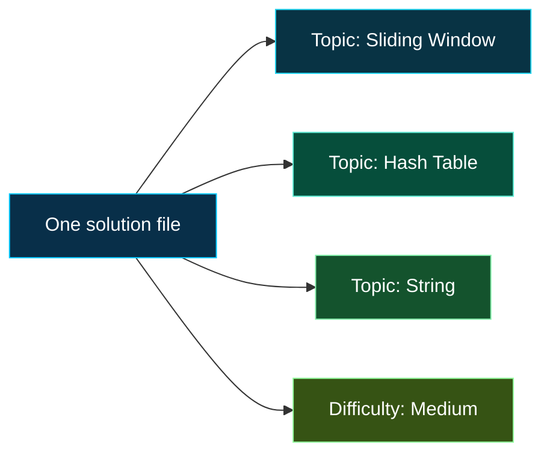

<div align="center">


<br>


<br><br>

A curated collection of LeetCode solutions built for **understanding**, **revision**, and **reuse**.

[Browse by Topic](./indexes/topics.md) &nbsp;|&nbsp; [Browse by Difficulty](./indexes/difficulty.md) &nbsp;|&nbsp; [Architecture](#repository-architecture) &nbsp;|&nbsp; [Solution Standard](#solution-standard)

</div>

---

## Repository Intent

This repository preserves more than accepted code. Each solution records:

| Pattern | Reasoning | Implementation |
| :---: | :---: | :---: |
| The ideas involved | The invariant that makes them work | The trade-offs shaping the final code |

Many LeetCode problems belong to several topics at once. A problem might combine **graphs**, **heaps**, and **greedy reasoning**, while still having only one implementation.

That leads to the central design rule:

> Store every solution once. Reference it from every topic and difficulty where it belongs.

---

## Browse the Archive

The physical files are organized by problem ID. The indexes provide different views of the same archive without duplicating solutions.

| View | Best used for | Open |
| :--- | :--- | :---: |
| **Topics** | Studying patterns and related techniques | [Explore topics](./indexes/topics.md) |
| **Difficulty** | Choosing an appropriate challenge level | [Explore difficulties](./indexes/difficulty.md) |
| **Problem ID** | Finding a known problem quickly | [Explore solutions](./solutions/) |

For example, `0003-longest-substring-without-repeating-characters.cpp` exists once under `solutions/0001-0500/`, but can appear under **Hash Table**, **String**, **Sliding Window**, and **Medium** in the indexes.

---

## Repository Architecture

```text
LeetCode-Solutions/
+-- solutions/
|   +-- 0001-0500/
|   |   +-- 0003-longest-substring-without-repeating-characters.cpp
|   +-- 0501-1000/
|   +-- 1001-1500/
|   +-- 1501-2000/
|   +-- ...
+-- indexes/
|   +-- topics.md
|   +-- difficulty.md
+-- templates/
|   +-- solution.cpp
+-- README.md
```

### Why this structure?

| Decision | Reason |
| :--- | :--- |
| **Store by ID range** | Every problem has one obvious, permanent location |
| **Index by multiple topics** | A solution can belong to every relevant technique |
| **Index by difficulty** | Difficulty remains browsable without controlling storage |
| **Never duplicate solution files** | Improvements happen in one place and links remain consistent |

Difficulty subfolders are intentionally avoided. A structure such as `Medium/Graphs/` still fails when a problem has multiple topics and encourages duplicate files.

---

## Classification Model



The **primary insight** explains the main breakthrough. The **topics** field captures every relevant classification.

---

## Solution Standard

Every solution should remain useful after the original problem is no longer fresh.

```cpp
/*
 * Problem: 0003. Longest Substring Without Repeating Characters
 * Link: https://leetcode.com/problems/longest-substring-without-repeating-characters/
 * Difficulty: Medium
 * Primary insight: Sliding Window
 * Topics: Hash Table, String, Sliding Window
 * Time: O(n)
 * Space: O(k)
 *
 * Insight:
 * Maintain a window containing no repeated characters.
 */
```

| Principle | What it means here |
| :--- | :--- |
| **One canonical solution** | Keep exactly one implementation of each problem |
| **Multiple classifications** | Link that implementation from every relevant index section |
| **Reasoning over narration** | Comments explain decisions and invariants, not obvious syntax |
| **Explicit complexity** | Time and space costs remain visible during revision |

---

## The Problem-Solving Loop


The goal is not to force each problem into one category. It is to understand how several techniques cooperate inside one solution.

---

## Toolkit

<p align="center">
  
</p>

Solutions are written primarily in modern **C++**, with an emphasis on standard-library fluency, explicit complexity, and interview-ready reasoning.

---

## Notes

- Problem statements and examples belong to [LeetCode](https://leetcode.com/).
- Solutions are personal implementations created for learning and reference.
- Indexes are navigation layers, not progress trackers.

---

<div align="center">


</div>

---

<div align="center">


<br><br>


</div>
